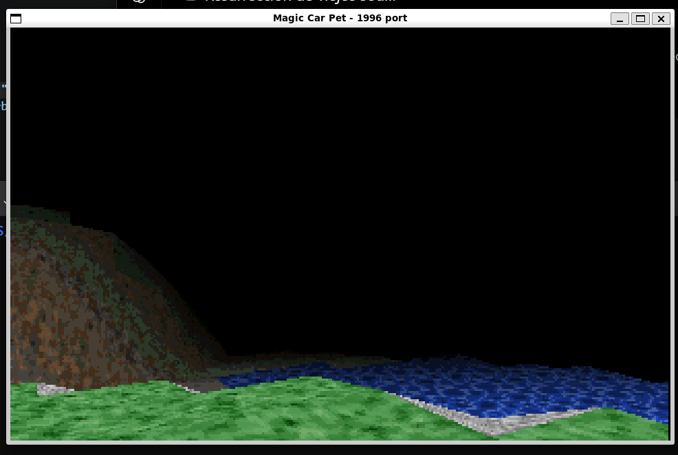
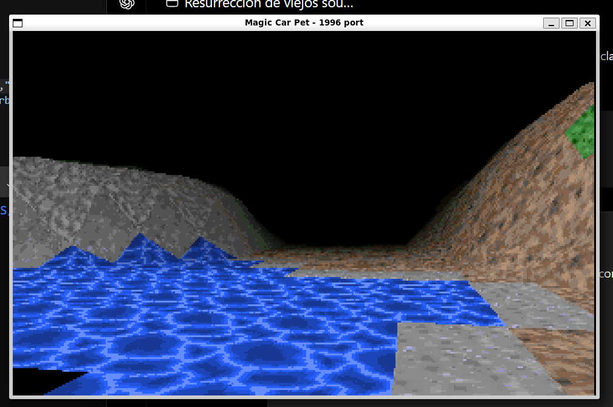

# Magic Carpet Fly - modern SDL2 port

Magic Car Pet 3d-project demo DJGPP/DOS 1996 Modern Port to SDL2 and some new c++17 minor adaptations.

Copyright (c) 1996 Aatu Koskensilta

## What it preserves:

- Original code of the engine (`mcpet.cpp`) and the texturizer (`tpf.cpp`) almost no changes.
- Original Assets: `fade.dat`, `h256.pcx`, `g256.pcx`, `t1.pcc` ... `t6.pcc`.
- Lógic Resolution 320x200, scaled to a SDL window.

## What was replaced:

- VGA `0x13` mode -> SDL2 window.
- DOS Keyboard Handler -> SDL2 events.
- Assembler fixed-point x86 -> portable C ++ with `int64_t`.
- `iostream.h` pre-standard -> erased.
- `grp.cc`, is missing in the original sources, was reimplemented as `grp_sdl.cpp`.

## Screenshots:

<p align="center">
  
  
</p>

## Keys:

- ESC: exit
- arrow keys: accelerate/brake-slow/turn
- Q/A: up/down
- PageUp/PageDown: look up/down
- U/J: tilt the camera

## Linux or windows WSL

```bash
sudo apt install build-essential cmake libsdl2-dev gdb
cmake -S . -B build
cmake --build build
./build/fly
```

## Note

This port is intencionally mínimun. It does not aim to modernize the engine or correct the internal logic; it simply replaces the old DOS/VGA PART so that it works again today.
